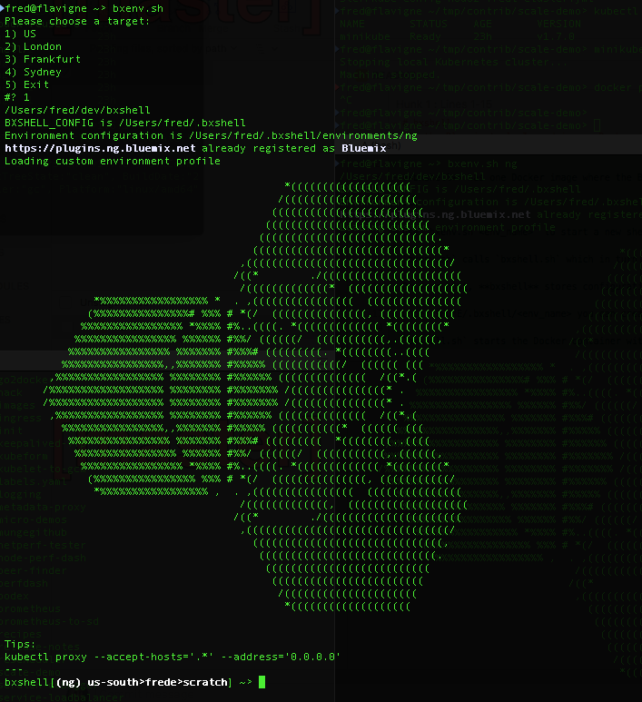

# bxshell - All the IBM Cloud tools I need in one Docker image and a few shell scripts

[](https://travis-ci.org/l2fprod/bxshell)

**bxshell** is made of one Docker image where the IBM Cloud CLI and its plugin have been preinstalled together with the CLI to work with containers. **bxshell** also provides a script to start the Docker image and to mount configuration directories into the image.



---

## Requirements

* Python 2.7.10
* Docker Engine

> Tested on macOS Sierra 10.12.6 with Docker Version 17.12.0-ce-mac49 (21995)

## Install

1. Clone the repository

   ```
   git clone https://github.com/l2fprod/bxshell
   ```

1. Add `bxshell/bin` directory to your path

1. Ensure your Docker engine is running

1. Start the shell for an environment with `bxshell <env_name>`

   ```
   bxshell us-south
   ```

   This retrieves the **bxshell** Docker image and starts a container.

## How it works

On your host, **bxshell** stores configuration files under `$HOME/.bxshell` where it creates one subfolder per environment. Under these folders, you'll find several configuration files created by the Docker container as you use the various IBM Cloud CLI and other scripts there.

Use `bxshell <env_name>` to start a new shell on the environment `env_name`. Environment name is arbitrary. You can use any name. This is only a way to keep configuration files together.

`bxshell` runs the Docker container interactively. The container will die when you quit the shell. It starts the Docker container with privileged mode and expose the local Docker socket inside the container so you can build images there too.

`bxshell` also mounts your `$HOME` directory and the `$HOME/.bxshell/environments directory` under /root/mnt in the container. This way you can access your files from within the container.

### Skip pulling the latest image

Use `bxshell -l <env_name>` to use the current Docker image in your local registry.

### Transient environment

Use `bxshell -t` to run the Docker container with no mount and no persistent storage.

## Environment Customization

Under `$HOME/.bxshell/<env_name>` you can create a `.env_profile` file to perform additional initialization when bxshell starts.

## Tools included in bxshell

The exact list can be found by looking at the [Dockerfile](Dockerfile).

* IBM Cloud CLI and cloud-functions, functions shell, container-registry, container-service, dev, schematics plugins
* cURL
* docker
* helm
* istio
* jq
* kubectl
* kubetail
* node.js 6.9.1
* nodemon
* nvm
* serverless framework and plugin
* terraform
* wget
* yarn

## Using X11 apps on macOS

1. Install [XQuartz](https://www.xquartz.org/index.html) X11 server

   ```
   brew cask install xquartz
   ```

1. Start XQuartz

1. In XQuartz shell, enable connection on a local IP address accessible by the Docker engine. It can be any IP address or hostname visible from the bxshell container. Here it uses the hostname on the host computer:

   ```
   echo $HOSTNAME
   xhost + $HOSTNAME
   ```

1. Start bxshell and from the shell, export DISPLAY to the host running XQuartz:

   ```
   export DISPLAY=ip-address_or_hostname:0
   ```

1. Start your X11 app, it should open on your Mac desktop

---

The program is provided as-is with no warranties of any kind, express or implied.
